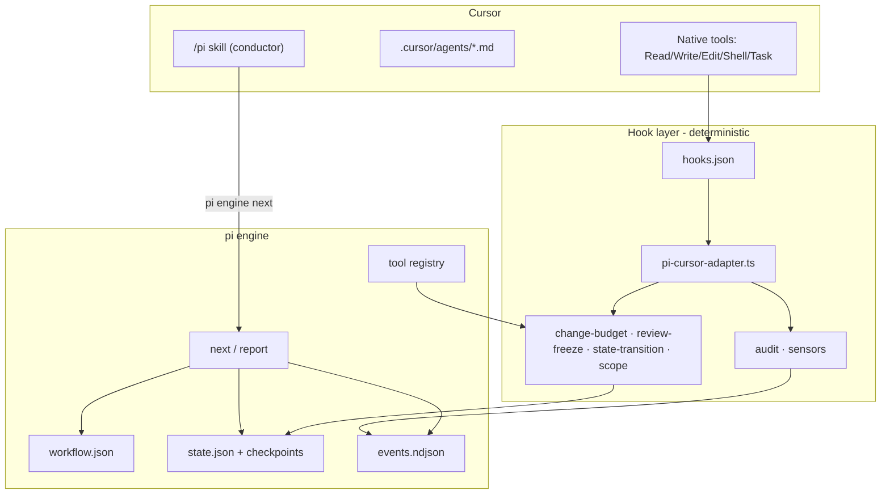

# `pi` — Build Plan

A workflow harness for coding agents: 7 personas, a JSON-defined workflow, an
extensible tool registry, enforced review checkpoints, and a durable state file.
Ships to Cursor first, portable to Claude Code / Copilot / others.

---

## 1. What we are building

`pi` is a **harness**, not an agent. The coding tool (Cursor today) already has
a model, a tool loop, and a UI. `pi` supplies what it lacks:

| Capability | Mechanism |
|---|---|
| Who is working | 7 personas projected as native subagents |
| What happens next | Deterministic engine (`pi engine next` / `report`) |
| What is allowed right now | `preToolUse` guard hooks (fail-closed) |
| Review before large changes | Change-budget guard + review receipts |
| Where we are | Durable state file + checkpoints |
| What happened | Append-only, Zod-validated event log |
| How to extend | Tool registry (one file per tool) |
| Which host | Harness manifests + packager |

The two reference repos supply complementary halves:

- **`aidlc-workflows`** — the *systems* half: core/harness split, engine vs
  conductor, hook adapters, state machine, audit, fail-closed guards.
- **`harness-engineering`** — the *typing* half: `EventType` enum, Zod tool
  schemas, AI SDK `tool()` definitions, the event log as the contract.

`pi` = AI-DLC's architecture expressed in harness-engineering's type style,
scaled down to 7 personas and a JSON workflow.

---

## 2. Design principles

1. **The engine decides routing; the model decides content.** Never let the LLM
   choose the next step in prose.
2. **Guards are deterministic and fast.** No LLM call inside `preToolUse`. Ever.
3. **Everything is a typed event.** One Zod discriminated union is the contract
   between engine, hooks, CLI, and any future UI.
4. **Tools are data.** Adding a tool means adding one file plus a registry entry
   — no engine changes.
5. **Dual-target tool definitions.** Each tool declares a Zod schema once, then
   projects into (a) a `pi` CLI verb the conductor invokes, and (b) an AI SDK
   `tool()` for headless runs. Same schema, two consumers.
6. **Harness-neutral core.** `core/` never mentions `.cursor`. A `{{HARNESS_DIR}}`
   token plus a manifest does the projection.
7. **Fail closed on safety, fail open on advice.** Guards deny on ambiguity;
   sensors only warn.

---

## 3. Architecture



Two control loops:

**Outer (conductor loop)** — the `/pi` skill runs: `next` → do one step →
`report` → repeat until `done`. Borrowed directly from AI-DLC's forwarding loop.

**Inner (guard loop)** — every Cursor tool call passes through `preToolUse`,
where guards consult the current step's policy and allow or deny.

---

## 4. Repo layout

```
pi/
  core/                          # harness-neutral source of truth
    schemas/
      events.ts                  # EventType enum + Zod union
      state.ts                   # RunState, Checkpoint
      workflow.ts                # WorkflowSpec, StepSpec
      directive.ts               # engine → conductor contract
      tool.ts                    # ToolSpec, ToolPolicy
      harness.ts                 # HarnessManifest
    engine/
      router.ts                  # next() / report() — pure, deterministic
      state-store.ts             # atomic read/write/checkpoint
      event-log.ts               # append-only NDJSON writer
      gates.ts                   # approval / review receipts
      graph.ts                   # workflow.json → compiled run graph
    agents/                      # 7 persona .md (frontmatter + prose)
    workflows/                   # *.workflow.json
    tools/                       # one file per tool (schema + execute)
      registry.ts
    hooks/                       # harness-neutral guard + observer bodies
    sensors/                     # deterministic checks
    templates/                   # state.md, checkpoint, onboarding
  harness/
    cursor/
      manifest.ts
      hooks.json
      hooks/pi-cursor-adapter.ts
      skills/pi/SKILL.md
      rules/pi.mdc
      cli.json
    claude/                      # M5
    copilot/                     # M5
  cli/
    pi.ts                        # `pi` entry — verb router
  tests/
    unit/ integration/ e2e/
  scripts/
    package.ts                   # core + harness → dist/<harness>/
  dist/                          # generated, gitignored
```

**Runtime layout inside a user's project:**

```
their-project/
  .cursor/                       # generated harness surface
    agents/ skills/ rules/ hooks/ hooks.json cli.json
  pi/                            # workspace shell (committed)
    workflows/                   # project-local workflow overrides
    runs/<run-id>/
      state.json                 # machine truth
      state.md                   # human-readable mirror
      events.ndjson              # audit log
      checkpoints/<step>.json
      artifacts/<step>/...
    memory/                      # org.md / team.md / project.md rules
```

**Stack:** Bun + TypeScript + Zod. Bun for fast subprocess startup (hooks fire
on every tool call) and `bun build --compile` for the shipped `pi` binary. AI SDK
enters only in M6 (headless runner).

---

## 5. The type spine

Everything flows from `core/schemas/`. Written once, consumed by engine, hooks,
CLI, and future UI.

### 5.1 Events

Follows the `EventType` enum pattern from `harness-engineering/shared/events.ts`,
upgraded to Zod so it validates at the process boundary.

```ts
export enum EventType {
  RunStarted      = "run.started",
  RunCompleted    = "run.completed",
  StepStarted     = "step.started",
  StepCompleted   = "step.completed",
  StepSkipped     = "step.skipped",
  CheckpointSaved = "checkpoint.saved",
  AgentActivated  = "agent.activated",
  ArtifactWritten = "artifact.written",
  ToolRequested   = "tool.requested",
  ToolDenied      = "tool.denied",
  ReviewRequested = "review.requested",
  ReviewResolved  = "review.resolved",
  GateOpened      = "gate.opened",
  GateResolved    = "gate.resolved",
  SensorFired     = "sensor.fired",
  HumanTurn       = "human.turn",
  GuardBlocked    = "guard.blocked",
  Log             = "log",
}

const base = { runId: z.string(), ts: z.number(), id: z.string() };

export const PiEvent = z.discriminatedUnion("type", [
  z.object({ ...base, type: z.literal(EventType.StepStarted),
             step: z.string(), agent: AgentId }),
  z.object({ ...base, type: z.literal(EventType.ReviewRequested),
             step: z.string(), summary: z.string(),
             changedFiles: z.array(z.string()), changedLines: z.number() }),
  z.object({ ...base, type: z.literal(EventType.GuardBlocked),
             guard: z.string(), tool: z.string(), reason: z.string() }),
  // ...one variant per EventType
]);

export type PiEvent = z.infer<typeof PiEvent>;
```

Every append goes through `PiEvent.parse()` — a malformed event never reaches
disk, and the log is replayable into any UI later.

### 5.2 Directive — engine to conductor

```ts
export const Directive = z.discriminatedUnion("kind", [
  z.object({ kind: z.literal("run-step"), step: StepSpec,
             agent: AgentId, toolGrants: z.array(z.string()),
             consumes: z.array(z.string()), produces: z.array(z.string()),
             gate: z.boolean(), narration: z.string().optional() }),
  z.object({ kind: z.literal("ask"), question: Question }),
  z.object({ kind: z.literal("review"), step: z.string(), receiptPath: z.string() }),
  z.object({ kind: z.literal("done"), summary: z.string() }),
  z.object({ kind: z.literal("error"), message: z.string() }),
]);
```

`next` returns **exactly one** directive as JSON on stdout and mutates nothing
except the active-directive marker. It is idempotent: asking twice for the same
state returns the same answer. That property is what makes it safe to call from
a hook.

### 5.3 State

```ts
export const RunState = z.object({
  version: z.literal(1),
  runId: z.string().uuid(),
  workflow: z.string(),
  createdAt: z.string().datetime(),
  goal: z.string(),
  currentStep: z.string().nullable(),
  steps: z.record(z.object({
    status: z.enum(["pending","active","awaiting-review",
                    "awaiting-approval","completed","skipped","failed"]),
    agent: AgentId,
    startedAt: z.string().datetime().optional(),
    completedAt: z.string().datetime().optional(),
    artifacts: z.array(z.string()).default([]),
    attempts: z.number().default(0),
  })),
  checkpoints: z.array(z.object({
    step: z.string(), at: z.string().datetime(), digest: z.string(),
  })),
});
```

Written atomically (temp file + rename), with `state.md` regenerated alongside
for humans and for the `sessionStart` context injection.

---

## 6. The personas

Seven agents, each a Markdown file with Zod-validated frontmatter. Kept
deliberately broad — AI-DLC's "small mob" argument: fewer agents means fewer
handoffs and less context loss.

| Agent | Owns | Typical steps |
|---|---|---|
| `business-analyst` | Requirements, acceptance criteria, verification that business intent is met | requirements, acceptance-review |
| `solution-architect` | System design, component boundaries, tech choices, ADRs | architecture, api-contract |
| `ui-designer` | Screens, flows, component inventory, design tokens, a11y | ux-design |
| `frontend-developer` | Client implementation, state, integration with contracts | frontend-implementation |
| `backend-developer` | Services, data models, APIs, migrations | backend-implementation |
| `devops-engineer` | IaC, CI/CD, environments, security posture, secrets | infrastructure, pipeline, security-review |
| `qa-engineer` | Test strategy and unit / integration / e2e tests, validation | test-plan, test-implementation, validation |

Frontmatter contract:

```yaml
---
id: backend-developer
name: Backend Developer
description: Implements services, data models, and APIs against approved contracts.
tools: [read, search, writeArtifact, writeCode, runCommand, requestReview]
denyTools: [delegate]          # no nested delegation, AI-DLC's rule
changeBudget: { maxFiles: 8, maxLines: 300 }
knowledge: [api-design.md, data-modeling.md]
---
```

`denyTools: [delegate]` mirrors AI-DLC's `disallowedTools: Task` — only the
conductor dispatches, workers never spawn workers.

Personas project into `.cursor/agents/*.md` as native Cursor subagents (Cursor
tolerates extra frontmatter keys, which AI-DLC verified live).

---

## 7. Workflow JSON

Workflows are data. A workflow names an ordered set of steps, each bound to an
agent, its tool grants, its artifacts, and its gate policy.

```json
{
  "id": "feature",
  "name": "Feature delivery",
  "version": 1,
  "description": "Full path from requirements to tested, deployable feature.",
  "defaults": { "gate": "approval", "checkpoint": true },
  "steps": [
    {
      "id": "requirements",
      "agent": "business-analyst",
      "objective": "Capture requirements and acceptance criteria.",
      "produces": ["requirements.md", "acceptance-criteria.md"],
      "tools": ["read", "search", "askUser", "writeArtifact"],
      "sensors": ["required-sections"]
    },
    {
      "id": "architecture",
      "agent": "solution-architect",
      "consumes": ["requirements.md"],
      "produces": ["architecture.md", "api-contract.md"],
      "tools": ["read", "search", "writeArtifact"],
      "sensors": ["required-sections", "upstream-coverage"]
    },
    {
      "id": "ux-design",
      "agent": "ui-designer",
      "when": "hasFrontend",
      "consumes": ["requirements.md"],
      "produces": ["ux-design.md"],
      "tools": ["read", "writeArtifact"]
    },
    {
      "id": "backend-implementation",
      "agent": "backend-developer",
      "consumes": ["api-contract.md", "architecture.md"],
      "produces": ["backend-summary.md"],
      "tools": ["read", "search", "writeCode", "runCommand", "requestReview"],
      "changeBudget": { "maxFiles": 8, "maxLines": 300 },
      "requireReviewBefore": ["writeCode"],
      "gate": "approval"
    },
    {
      "id": "frontend-implementation",
      "agent": "frontend-developer",
      "when": "hasFrontend",
      "consumes": ["api-contract.md", "ux-design.md"],
      "produces": ["frontend-summary.md"],
      "tools": ["read", "search", "writeCode", "runCommand", "requestReview"],
      "changeBudget": { "maxFiles": 8, "maxLines": 300 },
      "requireReviewBefore": ["writeCode"]
    },
    {
      "id": "tests",
      "agent": "qa-engineer",
      "consumes": ["backend-summary.md", "frontend-summary.md"],
      "produces": ["test-plan.md", "test-results.md"],
      "tools": ["read", "writeCode", "runCommand"],
      "sensors": ["type-check", "linter"]
    },
    {
      "id": "infrastructure",
      "agent": "devops-engineer",
      "when": "needsInfra",
      "produces": ["infrastructure.md", "pipeline.md"],
      "tools": ["read", "writeCode", "runCommand", "requestReview"],
      "gate": "approval"
    },
    {
      "id": "validation",
      "agent": "business-analyst",
      "consumes": ["acceptance-criteria.md", "test-results.md"],
      "produces": ["validation.md"],
      "tools": ["read", "runCommand", "writeArtifact"],
      "sensors": ["traceability"]
    }
  ]
}
```

Ship three to start: `feature` (above), `quick` (requirements → implement →
test), and `bugfix` (reproduce → fix → regression test). Project-local workflows
in `pi/workflows/` override shipped ones by `id`.

`when` conditions resolve against a small, closed fact set the engine computes
at compile time (`hasFrontend`, `needsInfra`, `isBrownfield`) — deliberately not
arbitrary expressions, so routing stays predictable.

---

## 8. Tool system

### 8.1 One definition, two targets

```ts
// core/tools/request-review.ts
export const requestReview = defineTool({
  id: "requestReview",
  description: "Pause and ask the human to review a proposed change before writing it.",
  policy: "gating",              // safe | mutating | gating | dangerous
  input: z.object({
    step: z.string(),
    summary: z.string(),
    rationale: z.string(),
    files: z.array(z.object({ path: z.string(), action: z.enum(["add","modify","delete"]) })),
    diff: z.string().optional(),
  }),
  output: z.object({ receiptId: z.string(), approved: z.boolean(), feedback: z.string().optional() }),
  cli: "pi review request",      // conductor invokes via Shell
  execute: async (args, ctx) => { /* headless path (M6) */ },
});
```

Registering it means adding one line to `core/tools/registry.ts`. The build then
derives, with no further edits:

- the CLI verb (`pi review request --step ... --summary ...`)
- the JSON schema guards consult for tool grants
- the AI SDK `tool()` for the headless runner
- documentation rows

### 8.2 Starter tool set

| Tool | Policy | Notes |
|---|---|---|
| `read`, `search` | safe | Maps onto host-native read/grep |
| `writeArtifact` | mutating | Writes into `pi/runs/<id>/artifacts/` |
| `writeCode` | mutating | Real source edits — subject to change budget |
| `runCommand` | mutating | Shell; denied for delegated agents doing dynamic eval |
| `askUser` | gating | Structured question, ends the turn |
| `requestReview` | gating | **The reviewer tool below** |
| `delegate` | dangerous | Conductor-only; workers carry `denyTools: [delegate]` |

### 8.3 The reviewer tool — small, reviewed changes

This is the requirement to "review and commit smaller changes," and it needs
**three cooperating parts**. Asking the model nicely is not enough.

**a. Declared budget.** A step declares `changeBudget: { maxFiles, maxLines }`.

**b. A guard that counts.** `change-budget-guard` runs on `preToolUse` for
`Write | Edit | Delete | Shell`. It tallies bytes/lines/files the current step
has already written (from the event log) plus the pending call. Over budget with
no fresh review receipt → deny, with a message naming the remedy:

```json
{"permission":"deny","agent_message":"This step has changed 6 files / 310 lines,
over its budget of 8 files / 300 lines. Run `pi review request` with a summary
and wait for approval before continuing."}
```

**c. A receipt with a fingerprint.** `pi review request` writes
`pi/runs/<id>/receipts/<step>-<n>.json` containing the human's decision plus a
digest of the reviewed plan. `pi review resolve --approve|--changes` records the
answer. The guard accepts a receipt only when it is fresh, human-minted, and
its digest still matches. AI-DLC's plan-approval and review-freeze guards are
the working precedent for all three properties.

**Result:** the agent physically cannot dump 1,500 lines. It hits the budget,
requests review, and you see a summary and file list before any large write
lands. Combine with `requireReviewBefore: ["writeCode"]` to force review even
on the first write of a step.

**Human presence.** A review receipt requires a `HumanTurn` event since the last
gate. Cursor mints one on `beforeSubmitPrompt`; a headless run (`agent -p`)
mints none, so an unattended model cannot approve its own work. Straight from
AI-DLC's presence gate.

### 8.4 The documentation contract

"Update the docs" written into a persona file is unenforceable and drifts per
repo. `pi` treats it the same way it treats review — declared as configuration,
delivered as instruction, checked deterministically.

**Declared** in `pi.config.json`, so a repo that keeps prose somewhere unusual
says so once:

```json
{
  "docs": {
    "dir": "docs",
    "files": ["README.md"],
    "required": true,
    "exempt": ["tests/", "**/*.test.*", "dist/"]
  }
}
```

**Delivered** by `renderDocsInstruction(config.docs)`, which generates the
sentence injected into a code-writing persona's brief. The persona file never
names a path, so relocating docs to `website/content/` updates every agent at
once.

**Checked** by the `docs-coverage` sensor at step completion: a step that
changed non-exempt source and touched no documentation surface is flagged.
Advisory by default (it reports at the gate rather than blocking a write),
because "does this change need docs?" has real false positives — unlike the
change budget, which is a hard count.

The developer, architect, and devops personas carry the contract. QA and the
business analyst do not: their outputs are already prose artifacts.

---

## 9. State, checkpoints, traceability

- **`state.json`** — machine truth, atomic writes, Zod-validated on every read.
- **`state.md`** — regenerated mirror; injected as session context on
  `sessionStart` so a fresh chat knows where it is.
- **`events.ndjson`** — append-only, one Zod-validated event per line. The
  audit trail and the replay source.
- **`checkpoints/<step>.json`** — snapshot at each step boundary: state digest,
  artifact list, receipt ids, git HEAD. Enables `pi resume` and `pi rewind`.
- **Traceability** — each artifact records the step, agent, and consumed inputs
  that produced it. The `traceability` sensor verifies every acceptance
  criterion reaches a test and every test reaches a requirement.

`pi status` renders the current step, progress, pending gates, and the last few
events. `pi log --step <id>` shows one step's slice.

---

## 10. Harness layer

A harness manifest describes how `core/` projects into one host.

```ts
export const HarnessManifest = z.object({
  name: z.string(),                 // "cursor"
  harnessDir: z.string(),           // ".cursor"
  agentsDir: z.string(),            // "agents"
  skillsDir: z.string(),            // "skills"
  invoke: z.string(),               // "/pi"
  hookWiring: z.enum(["cursor-camel","claude-pascal","copilot-json"]),
  guardResponse: z.enum(["permission-json","exit-code"]),
  supportsStopBlock: z.boolean(),   // Cursor: false (advisory nudge only)
  supportsSubagentIdentity: z.boolean(),
});
```

### Cursor specifics (verified in the AI-DLC port)

- Only `.cursor/{rules,agents,skills,commands,hooks.json,mcp.json,cli.json}`
  carry native meaning; engine directories can sit beside them inertly.
- Hook events are camelCase; `preToolUse` must answer
  `{"permission":"allow"|"deny"}` on **stdout**, with `failClosed: true`.
  Empty stdout is invalid JSON and blocks in the IDE — always emit `allow`
  explicitly.
- Cursor's shell tool is `Shell` (map to a canonical `Bash` internally) and it
  has a first-class `Delete` tool — treat `Delete` as a write in guards.
- The `stop` hook cannot refuse a stop; only a `followup_message` nudge. The
  conductor skill's loop discipline is the real enforcement.
- Subagent calls carry no reliable identity. If we use `Task` delegation, we
  need a project-local delegation ledger. **Mitigation for v1: run every step
  inline in the conductor** (adopt the persona rather than dispatch). Defer
  `Task` fan-out until M5 — it is the single largest complexity sink in the
  AI-DLC Cursor adapter (~3k lines, most of it attribution).

`hooks.json` we generate:

```json
{
  "version": 1,
  "hooks": {
    "sessionStart":       [{ "command": "pi hook cursor session-start" }],
    "beforeSubmitPrompt": [{ "command": "pi hook cursor mint" }],
    "preToolUse":         [{ "command": "pi hook cursor guards", "failClosed": true }],
    "postToolUse":        [{ "command": "pi hook cursor observe" }],
    "stop":               [{ "command": "pi hook cursor stop", "loop_limit": 10 }],
    "sessionEnd":         [{ "command": "pi hook cursor session-end" }]
  }
}
```

One adapter target per event, each normalizing the host payload into a canonical
`HookInput` schema, then calling shared guard functions **in-process** (AI-DLC
subprocesses into separate hook files; in-process keeps `preToolUse` latency low).

**Porting contract.** A new harness needs: a manifest, a payload normalizer, a
guard-response encoder, and a skill file. Everything else is generated. That is
the test of whether the abstraction is real — M5 exists to prove it.

---

## 11. CLI surface

```
pi init [--harness cursor]        # scaffold .cursor/ + pi/ in a project
pi doctor                         # verify wiring, permissions, binaries
pi start "<goal>" [--workflow feature]
pi status [--json]
pi resume | pi rewind --step <id>
pi engine next [--json]           # conductor-facing
pi engine report --step <id> --result <outcome> [--user-input "..."]
pi review request --step <id> --summary "..." --files a.ts,b.ts
pi review resolve --approve | --changes "..."
pi workflow list | show <id> | validate <path>
pi agents list | show <id>
pi tools list | show <id>
pi hook <harness> <target>        # hook dispatch (not user-facing)
pi log [--step <id>] [--json]
pi build                          # dev: core + harness → dist/
```

Distributed as a compiled Bun binary; no runtime Bun/Node requirement for users.

---

## 12. Conductor protocol

The `/pi` skill in `.cursor/skills/pi/SKILL.md`:

```
Loop:
  1. directive = `pi engine next $ARGUMENTS`
  2. act on directive.kind
  3. after step work: `pi engine report --step <id> --result <outcome>`
  4. repeat until kind == "done"
```

Rules carried in the skill (all learned from AI-DLC's failure modes):

- Never re-derive routing in prose. The engine owns sequencing.
- On `run-step`, read the persona file and `consumes` artifacts **before**
  starting work.
- Say the directive's `narration` when present; otherwise stay quiet. Do not
  narrate internal mechanics.
- On `error`, print the message verbatim and stop.
- Before a large write, call `pi review request` — do not wait to be denied.

---

## 13. Milestones

### M0 — Foundations (schemas + engine core)
`core/schemas/*`, `state-store.ts`, `event-log.ts`, `graph.ts`, `router.ts`.
Unit tests for `next` idempotency and atomic state writes.
**Exit:** `pi engine next` routes a hard-coded workflow end to end in tests.

### M1 — Workflow + personas + CLI
Three workflow JSONs, 7 persona files, workflow/agent validators, and
`pi start | status | engine next | engine report | workflow | agents`.
**Exit:** a full run advances through every step from the CLI, no host involved.

### M2 — Cursor harness
Manifest, packager, `.cursor/` projection, `SKILL.md`, `rules/pi.mdc`,
`hooks.json`, adapter, `session-start` context injection, `mint` human turns,
audit observer.
**Exit:** `/pi Build a todo API` runs a real workflow in Cursor with gates.

### M3 — Tools + the reviewer gate
Tool registry, the 7 starter tools, `change-budget-guard`, `review-freeze-guard`,
`state-transition-guard`, receipts with digests, `pi review request|resolve`.
**Exit:** an oversized write is denied, review is requested, approval unblocks it
— proven by an integration test that drives the guard directly.

### M4 — Checkpoints, sensors, resume
Checkpoint writer, `pi resume`, `pi rewind`, sensors (`required-sections`,
`upstream-coverage`, `traceability`, `type-check`, `linter`), `pi doctor`.
**Exit:** kill a session mid-run and resume exactly where it stopped.

### M5 — Second harness (portability proof)
Claude Code or Copilot: manifest + normalizer + skill only. Any core change
needed here is a design bug to fix in the abstraction.
**Exit:** the same workflow runs on two hosts from one core.

### M6 — Headless runner (optional, AI SDK)
`streamText` loop over the same tool registry for CI / unattended runs. Reuses
tool schemas and the event log; gated steps refuse without human presence.
**Exit:** `pi run --headless --workflow quick` completes a non-gated workflow.

---

## 14. Testing

Four tiers, mirroring AI-DLC's:

- **smoke** — CLI boots, schemas parse, registry resolves.
- **unit** — router decisions, state transitions, guard decisions as pure
  functions (table-driven: tool + step + budget + receipts → allow/deny).
- **integration** — packager output shape, hook adapter payload normalization,
  end-to-end `next`/`report` over a temp project.
- **e2e** — drive `cursor-agent -p` against a fixture project; assert on the
  event log rather than on model prose.

Two properties deserve dedicated tests from day one, because they are the ones
that break silently: **`next` idempotency** and **guard fail-closed behavior on
malformed input**.

---

## 15. Open decisions

1. ~~**Inline vs delegated personas on Cursor.**~~ **Decided: inline for v1.**
   The conductor adopts each persona rather than dispatching a `Task` subagent.
   This avoids Cursor's subagent-attribution problem entirely, which is where
   most of AI-DLC's Cursor adapter complexity lives. Revisit delegation in M5
   only if parallel step execution proves necessary.
2. **Where artifacts live.** Under `pi/runs/<id>/artifacts/` (isolated, easy to
   diff) vs directly in the repo (`docs/`). Recommendation: run-local, with an
   explicit `pi publish` step.
3. **Git integration.** Should a passed review auto-commit with a generated
   message? Recommendation: offer `pi review resolve --approve --commit` but
   never commit implicitly.
4. **Change budget default.** 8 files / 300 lines is a starting guess; tune after
   real use and make it settable in `pi/memory/project.md`.
5. **Learning loop.** AI-DLC promotes confirmed corrections into `project.md`.
   Worth copying, but it is a v2 feature — not on the critical path.

---

## Immediate next step

Scaffold M0: `package.json`, `tsconfig.json`, `core/schemas/` (events, state,
workflow, directive, tool), and the state store with its tests. That is roughly
a day of work and unblocks everything else.
