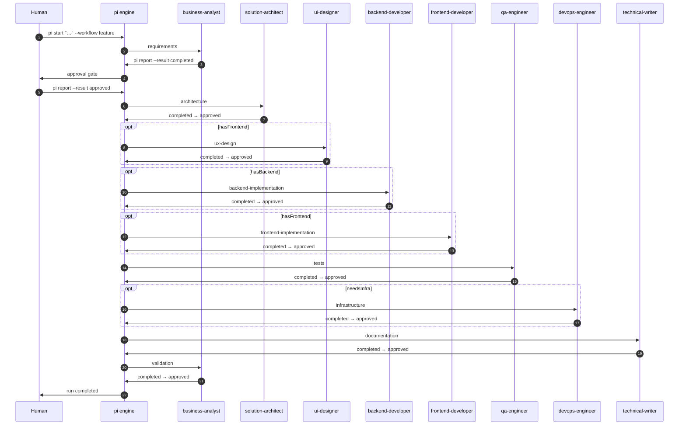

# Workflows

**This page answers one question: how do I change the steps, and what may a step
declare?**

A workflow is data, not code. Adding a step, reordering the flow, or tightening
a budget is a JSON edit — there is no engine change and nothing to rebuild.

## Two layers

This is the first thing to understand, because it is the thing that confuses
people.

| Layer | Lives in | Role |
| --- | --- | --- |
| Shipped | `core/workflows/` inside the pi installation | The five that come with pi |
| Project | `pi/workflows/` in your repository | Yours |

**Project workflows load second and shadow a shipped one with the same id.** So
you customize `feature` by writing your own `pi/workflows/feature.workflow.json`
— you do not edit the installation, and you do not lose your version when pi
updates.

`pi workflows` marks project ones `(project)`. `pi init` creates the directory.

The same two-layer rule applies to personas; see [Personas](12-personas.md).

## How a run moves through personas

A workflow is a **sequence of steps**, not parallel work. pi hands out one step
at a time; each step names exactly one persona. When a step finishes (and its
gate clears, if it has one), the run advances to the next step in workflow
order — the engine decides, not the agent.

The `feature` workflow is the fullest example. Solid arrows are always present;
dashed steps run only when the matching `facts` value is true at `pi start`:



Three things the diagram compresses but you should keep in mind:

**Artifacts chain the steps.** `architecture` consumes `requirements.md`; `tests`
consumes `acceptance-criteria.md`. A step reads what earlier steps produced
rather than guessing.

**The same persona can appear more than once.** `business-analyst` opens the run
(requirements) and closes it (validation). Each appearance is a separate step
with its own budget, gate, and artifacts.

**Gates repeat per step.** Every `completed → approved` pair is an approval gate
unless the step declares `gate: "none"`. The human turn between gates is what
stops an agent from approving its own work — see
[Reviews and budgets](../guides/06-reviews-and-budgets.md).

Shorter workflows are subsets of the same pattern. `quick` is requirements →
backend-developer → qa-engineer. `bugfix` is qa-engineer → backend-developer →
qa-engineer again, then technical-writer when docs may need updating. `docs`
rotates technical-writer steps and ends with a
business-analyst accuracy pass. `product-discovery` is three business-analyst
steps — survey what exists, prioritize with a stakeholder, route approved items
into copy-paste `pi start` handoffs — and writes no production code.

## The smallest workflow that works

```json
{
  "id": "review-only",
  "name": "Review only",
  "version": 1,
  "description": "Read the code and write down what is wrong with it.",
  "steps": [
    {
      "id": "assess",
      "agent": "solution-architect",
      "objective": "Find the three things most worth fixing, and say why.",
      "produces": ["assessment.md"],
      "tools": ["read", "search", "write-artifact"]
    }
  ]
}
```

Save as `pi/workflows/review-only.workflow.json` and run
`pi start "..." --workflow review-only`.

`id` and step ids are lowercase kebab-case. Artifact names are lowercase, with
dots and dashes allowed — `api-contract.md` is fine, `API Contract` is not.

## What a step may declare

| Field | Required | Default | Meaning |
| --- | --- | --- | --- |
| `id` | yes | — | Kebab-case, unique in the workflow |
| `agent` | yes | — | The persona that leads the step |
| `objective` | yes | — | What it is for, in your words |
| `consumes` | no | `[]` | Artifacts it reads |
| `produces` | no | `[]` | Artifacts it writes |
| `tools` | no | `[]` | Tool ids it may use |
| `when` | no | `[]` | Conditions under which it runs |
| `gate` | no | from defaults | `approval` or `none` |
| `checkpoint` | no | from defaults | Save a rewind boundary when it finishes |
| `changeBudget` | no | from defaults | `{ maxFiles, maxLines }` |
| `requireReviewBefore` | no | `[]` | Tools needing an approved review first |
| `sensors` | no | `[]` | Advisory checks to run at completion |

### `tools`

The eight tool ids are `read`, `search`, `ask-user`, `write-artifact`,
`write-code`, `run-command`, `request-review`, and `delegate`.

**Anything not listed is refused.** A step that forgets `write-code` cannot
write code, however its objective is worded.

The set is closed, so a typo is a compile error rather than a capability that
silently never worked.

`delegate` is never granted to any persona. Only the conductor dispatches work,
so a worker cannot quietly become an orchestrator and bury a decision one level
deeper than the log can see.

**A step cannot grant a tool the persona does not hold.** The persona is a
ceiling and asking nicely does not widen it — that is a compile error too.

### `consumes` and `produces`

Artifact names are logical, not paths. Declare `produces: ["requirements.md"]`
and the engine decides where it lives under the run directory, so a workflow
never hard-codes layout.

Two rules the compiler enforces:

- Every consumed artifact must be produced by an **earlier** step.
- Every artifact must be produced by **exactly one** step.

That second rule is what lets a consuming step find an input without being told
where it came from.

### `when`

```json
"when": ["hasFrontend"]
"when": ["hasBackend", "!isBrownfield"]
```

Conditions are **ANDed** — all must hold. A leading `!` negates.

The testable facts are a closed set of four: `hasFrontend`, `hasBackend`,
`needsInfra`, `isBrownfield`. **Anything else fails to compile**, with an error
listing the known names. That is deliberate: a workflow author can say "only
when there is a frontend" but cannot embed logic the engine is unable to explain
back to the user.

Conditions resolve against `facts` in `pi.config.json`, **once, at `pi start`**.
A fact that is absent counts as false. See
[Configuration](../reference/09-configuration.md).

### `gate` and `checkpoint`

`gate: "approval"` stops for a human. `gate: "none"` advances automatically.

Use `none` for steps whose output the next step will obviously expose anyway,
and keep `approval` wherever a wrong answer is expensive to unwind. Every gate
costs a round trip, so a workflow that gates everything gets abandoned.

`checkpoint: true` records a rewind boundary, including the git commit at that
moment.

### `changeBudget` and `requireReviewBefore`

```json
"changeBudget": { "maxFiles": 6, "maxLines": 200 },
"requireReviewBefore": ["write-code"]
```

Both `maxFiles` and `maxLines` are required together and must be positive.

`requireReviewBefore` forces a plan-then-write rhythm: the named tool is refused
until a human has approved a review for the step, however small the first change
is. **It is checked before the budget**, so on such a step the first write is
refused even when it is one line. Use it when you want to see the plan, not just
the overflow.

### `sensors`

```json
"sensors": ["required-sections", "docs-coverage", "type-check"]
```

Advisory only; they never block. The six available ones and their skip
conditions are in [Sensors](../reference/10-sensors.md).

**Any step that grants `write-code` should include `docs-coverage`.** The sensor
warns at the gate when source changed but no documentation surface was touched.
Every shipped workflow follows this on its implementation steps; add it to
project workflows the same way. Test-only changes are usually exempt via
`docs.exempt` in `pi.config.json`.

**Sensors are a closed registry in pi's own code.** Unlike workflows and
personas, you cannot add one from your project — a name with no registered
sensor is reported as a skip at the gate, which is silent. If you need a check
pi does not have, the practical route today is a shell command wired into
`checks.typeCheck` or `checks.lint`, or a step that runs it with `run-command`.

## Defaults

```json
"defaults": { "gate": "approval", "checkpoint": true }
```

Inherited by any step that does not set the field itself. Omit the block and you
get `gate: "approval"` and `checkpoint: true`.

`defaults.changeBudget` has no default — absent from both the step and the
defaults means the step is unlimited.

Project-wide budgets in `pi.config.json` are a separate ceiling; the stricter of
the two wins.

## Compile-time refusals

The compiler rejects a workflow whose wiring cannot work, rather than failing
halfway through a run. It refuses:

- A step naming a persona that is not in the roster
- A step granting a tool the persona does not hold
- A consumed artifact that no step produces, or that a later step produces
- An artifact produced by two steps
- A `when` condition naming an unknown fact
- An id or artifact name that is not in the required shape

`pi doctor` reports these with the file and line. A broken workflow does not
crash pi; it is reported and the others still load.

## Changing a workflow mid-run

You can, and pi will notice. A run records a digest of the compiled workflow it
started from, so if the file changes underneath it the router says so rather than
routing against a definition that no longer matches the recorded steps.

Treat a mid-run edit as a new run.

## Checking your work

```bash
pi workflows                    # everything loaded, project ones marked
pi workflows review-only        # the steps, personas, and resolved defaults
pi doctor                       # what failed to load, and why
```

`pi workflows <id>` shows defaults **after** resolution, which is the quickest
way to confirm a step inherited the gate you expected.
